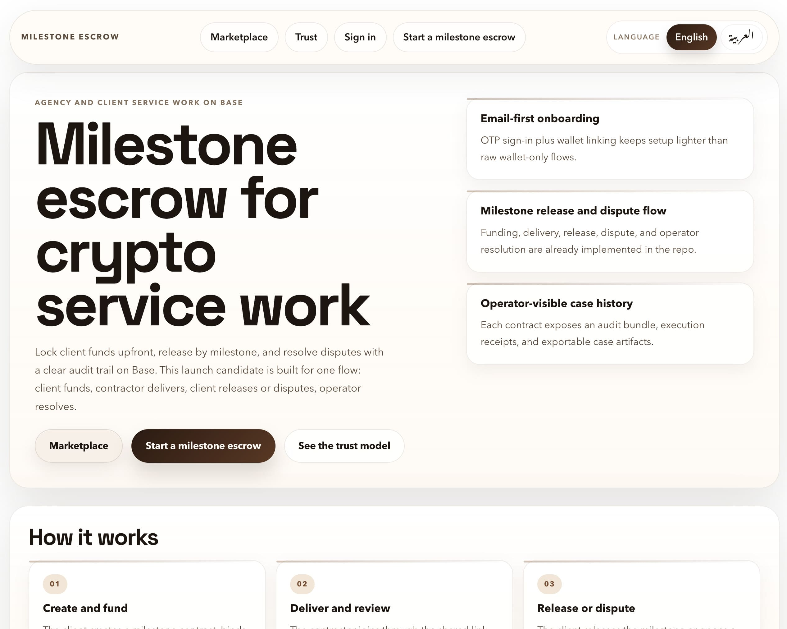
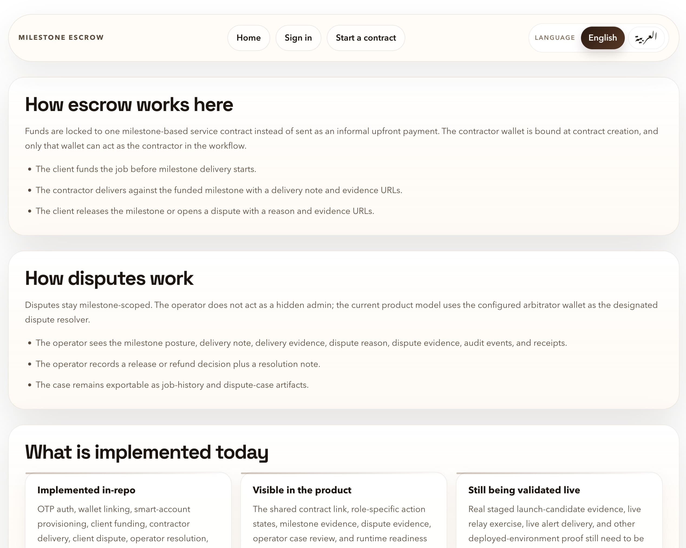

# Escrow4337

Escrow4337 is an escrow-first hiring marketplace on Base. The target product is a fixed-price, milestone-first, crypto-native alternative to traditional freelance marketplaces: discover talent, post structured work, hire through milestone escrow, manage delivery inside the platform, and resolve release/dispute flows with auditable onchain settlement.

This repo is not a blank-slate marketplace build. It already has meaningful escrow, onboarding, marketplace, moderation, and operator foundations. The current program is to turn those slices into a production-grade Upwork-style blockchain marketplace without throwing away the strongest existing primitives.

## Screenshots





## Active Direction

The active roadmap is [Marketplace Plan V1](./docs/MARKETPLACE_PLAN_V1.md).

The active implementation set is:

- [Marketplace Implementation V1](./docs/MARKETPLACE_IMPLEMENTATION_V1.md)
- [Marketplace Design Guide V1](./docs/MARKETPLACE_DESIGN_GUIDE_V1.md)
- [Marketplace Phase 0 Backlog V1](./docs/MARKETPLACE_PHASE_0_BACKLOG_V1.md)

The immediate focus is Phase 0: production hardening, staging proof, relay/provider validation, chain/reconciliation confidence, and release-gating around a real marketplace-origin flow.

## What Exists Today

The strongest implemented slices today are:

- onchain milestone escrow through `WorkstreamEscrow`
- OTP + SIWE + smart-account onboarding
- guided contract authoring and contractor join workflow
- off-chain marketplace primitives for talent, opportunities, and applications
- shortlist/reject/hire flows and hire-to-escrow conversion
- dossier scoring and escrow-derived reputation signals
- abuse reporting, moderation, operator dispute tooling, exports, and operations-health surfaces

This repo is already beyond “contract demo” stage. The current gaps are mostly production hardening, deeper ranking/trust systems, broader RBAC, richer hiring pipeline workflows, and real staged proof.

## Product Thesis

Escrow4337 is being built as:

- a Base-first hiring marketplace
- a fixed-price, milestone-first product
- a USDC-first settlement model
- a crypto-native onboarding experience with wallet authority
- a hybrid architecture where money movement is onchain and marketplace workflows remain off-chain

The narrow launch scope is intentional:

- one client organization
- one hired freelancer or one agency seat acting as worker
- milestone-based contracts
- operator-resolved disputes
- no hourly tracker
- no multi-chain support

## Core Differentiators

- Email-first onboarding with wallet authority instead of wallet-first friction.
- ERC-4337-style smart-account provisioning and execution posture.
- Onchain milestone funding, release, dispute, resolution, and remainder handling.
- A persisted orchestration layer that bridges marketplace hiring to escrow settlement safely.
- Operator/admin surfaces for trust, moderation, reconciliation, and dispute handling.

## Current Architecture

High-level repo layout:

- `packages/contracts`
  Foundry workspace containing `WorkstreamEscrow.sol` and contract tests.
- `services/api`
  NestJS API for auth, wallet, escrow, marketplace, moderation, deployment validation, runtime profile, and operations tooling.
- `apps/web`
  Next.js product surface for public marketplace routes plus authenticated client/talent flows.
- `apps/admin`
  Next.js operator surface for moderation, dispute review, exports, chain sync posture, and operations health.
- `packages/frontend-core`
  Shared frontend primitives, async-state helpers, locale support, walkthrough/spatial subpaths, and UI building blocks.
- `packages/compliance`
  Compliance policy package used by the API.

Durable architecture context lives in [docs/ARCHITECTURE.md](./docs/ARCHITECTURE.md).

## Implemented Capabilities

- `WorkstreamEscrow` supports job creation, funding, milestone delivery/release, disputes, resolution, and remainder refunds.
- The API persists auth, wallet, escrow, and marketplace state through repository-backed persistence with Postgres and file-backed test adapters.
- OTP/email delivery is provider-backed and rollback-safe.
- Auth runtime policy is environment-driven and includes IP-aware OTP throttling.
- Wallet linking uses SIWE proof, and smart-account provisioning persists execution metadata and sponsorship posture.
- Marketplace records now include structured `TalentProfile`, `Opportunity`, and `Application` entities with public browse/detail routes and authenticated CRUD.
- Marketplace hiring already supports shortlist/reject/withdraw/hire transitions and a bridge into the existing escrow job model.
- Public marketplace detail pages surface structured opportunity/profile data plus escrow-derived reputation signals.
- Admin/operator surfaces support dispute review, export downloads, operations health, chain-sync preview/persist, and moderation workflows.

## What Is Still Missing

The repo still needs:

- real staged proof for email relay, smart-account relay, bundler/paymaster, and escrow execution relay
- a stronger role and organization model
- search/read models and better ranking
- proposal revisions, interviews, and offers
- proposal-to-contract draft pipeline
- a true post-hire project room
- public reviews and fuller reputation systems
- fee/treasury/support workflows

That sequence is now documented in the phase docs rather than one broad aspirational roadmap.

## Docs Map

- [Marketplace Plan V1](./docs/MARKETPLACE_PLAN_V1.md)
  Product thesis and target architecture.
- [Marketplace Implementation V1](./docs/MARKETPLACE_IMPLEMENTATION_V1.md)
  Phase index and execution order.
- [Marketplace Design Guide V1](./docs/MARKETPLACE_DESIGN_GUIDE_V1.md)
  Shared marketplace UI/UX direction.
- [Marketplace Phase 0 V1](./docs/MARKETPLACE_PHASE_0_V1.md)
  Production hardening and release-proof phase.
- [Marketplace Phase 0 Backlog V1](./docs/MARKETPLACE_PHASE_0_BACKLOG_V1.md)
  Concrete immediate backlog for the current execution slice.
- [docs/project-state.md](./docs/project-state.md)
  Durable repo memory and current truths.
- [docs/_local/current-session.md](./docs/_local/current-session.md)
  Local working memory for the active slice when present.

## Local Setup

### Prerequisites

- Node 20+
- `pnpm`
- Foundry
- Docker or a native Postgres 16+ install for the local API path

### Install

```bash
pnpm install
```

### Local Postgres/API Flow

```bash
cp infra/postgres/.env.example infra/postgres/.env
pnpm db:up
cp services/api/.env.local.example services/api/.env.local
pnpm --filter escrow4334-api db:migrate
pnpm --filter escrow4334-api start:dev
```

If you change the local API port from `4100`, mirror that in `NEXT_PUBLIC_API_PORT` for `apps/web` and `apps/admin`.

### Frontend Environment

- `apps/web/.env.example`
- `apps/admin/.env.example`

### Production-Like API Environment

- `services/api/.env.example`

Do not commit real secrets.

## Verification

Useful repo entrypoints:

```bash
pnpm verify:ci
pnpm launch:candidate
pnpm verify:authority:deployed
pnpm test
pnpm lint
pnpm typecheck
cd packages/contracts && forge test
```

Important repo truths:

- `pnpm verify:ci` is the canonical non-mutating local/CI gate.
- `pnpm launch:candidate` is the canonical deployed release-candidate gate.
- `pnpm verify:authority:deployed` is the staged authority proof runner.
- You should not claim readiness beyond the checks you actually ran.

## Development Workflow

1. Read [AGENTS.md](./AGENTS.md).
2. Read [docs/project-state.md](./docs/project-state.md).
3. Read `docs/_local/current-session.md` if it exists locally.
4. Follow the active roadmap and phase docs instead of stale historical plan threads.
5. Make one cohesive change at a time and update repo memory when long-term direction or the current slice changes.

Additional contributor guidance:

- [CONTRIBUTING.md](./CONTRIBUTING.md)
- [COLLABORATION.md](./COLLABORATION.md)
- [CLAUDE.md](./CLAUDE.md)
- [SECURITY.md](./SECURITY.md)

## License

MIT. See [LICENSE](./LICENSE).
